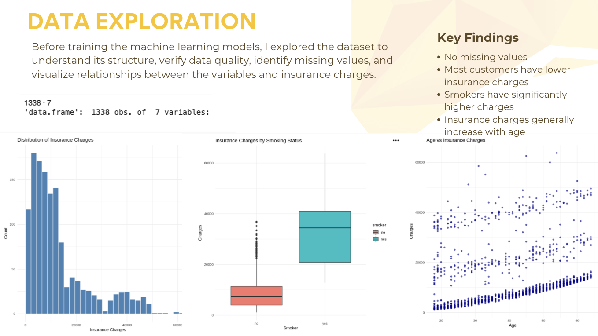
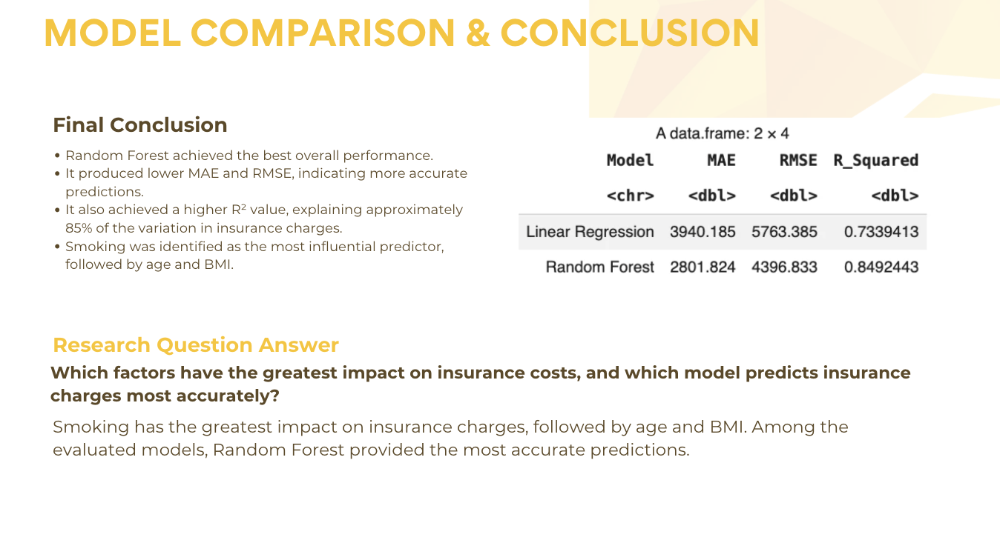
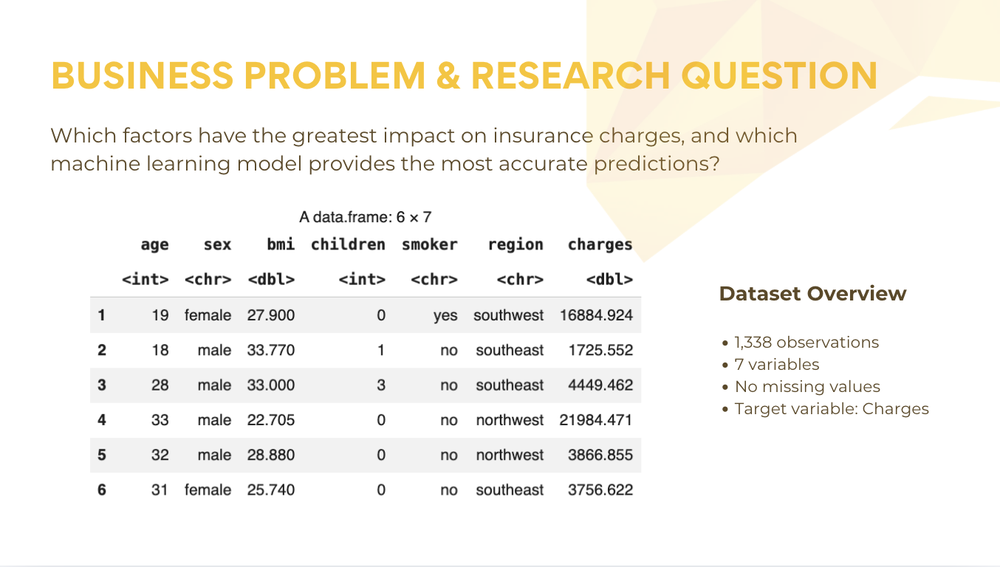

# Predicting Insurance Charges Using Machine Learning

Machine Learning project comparing **Linear Regression** and **Random Forest Regression** models to predict medical insurance charges using **R**.

---

# Project Overview

This project investigates the factors that influence medical insurance charges and compares two machine learning regression models to determine which provides the most accurate predictions.

The objective was to:

- Identify the variables that have the greatest impact on insurance charges.
- Compare Linear Regression and Random Forest performance.
- Evaluate prediction accuracy using MAE, RMSE, and R².

---

# Business Problem

Medical insurance costs vary significantly between individuals.

This project answers two key questions:

1. Which factors have the greatest impact on insurance charges?
2. Which machine learning model predicts insurance charges most accurately?

### Dataset

- **1,338 observations**
- **7 variables**
- **No missing values**

**Features**

- Age
- Sex
- BMI
- Children
- Smoker
- Region

**Target Variable**

- Insurance Charges

---

# Data Exploration

Before building the models, exploratory data analysis (EDA) was performed to better understand the dataset.

### Key Findings

- No missing values were found.
- Insurance charges are right-skewed.
- Smokers generally have much higher insurance charges.
- Insurance costs increase with age.

---

# Data Preparation

The dataset was prepared by:

- Converting categorical variables into factors.
- Splitting the data into:
  - **80% Training Set**
  - **20% Testing Set**

This ensured that both models were evaluated using unseen data.

---

# Models Developed

## 1. Linear Regression

The first model was a Linear Regression model, used as the baseline.

### Performance

| Metric | Value |
|--------|------:|
| MAE | 3940.185 |
| RMSE | 5763.385 |
| R² | 0.734 |

### Key Findings

- Smoking had the strongest positive effect.
- BMI and Age were also significant.
- Sex and Region showed relatively small influence.

---

## 2. Random Forest Regression

Random Forest was trained to capture more complex and non-linear relationships.

### Performance

| Metric | Value |
|--------|------:|
| MAE | 2801.824 |
| RMSE | 4396.833 |
| R² | **0.849** |

### Feature Importance

1. Smoker
2. Age
3. BMI
4. Children
5. Region
6. Sex

---

# Results

## Model Performance

| Model | MAE | RMSE | R² |
|------|------:|------:|------:|
| Linear Regression | 3940.185 | 5763.385 | 0.734 |
| Random Forest | **2801.824** | **4396.833** | **0.849** |

### Final Conclusion

The **Random Forest** model achieved the best overall performance.

Compared with Linear Regression, it produced:

- Lower MAE
- Lower RMSE
- Higher R²
- Better predictive accuracy

The analysis also identified **Smoking** as the strongest predictor of insurance charges, followed by **Age** and **BMI**.

---

# Technologies Used

- R
- Machine Learning
- Linear Regression
- Random Forest
- Data Visualization
- Exploratory Data Analysis (EDA)

---

# Author

**Mouza AlDarmaki**

Business Analytics Track

2026
